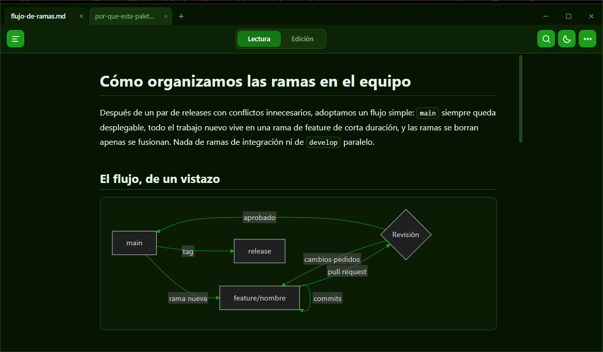
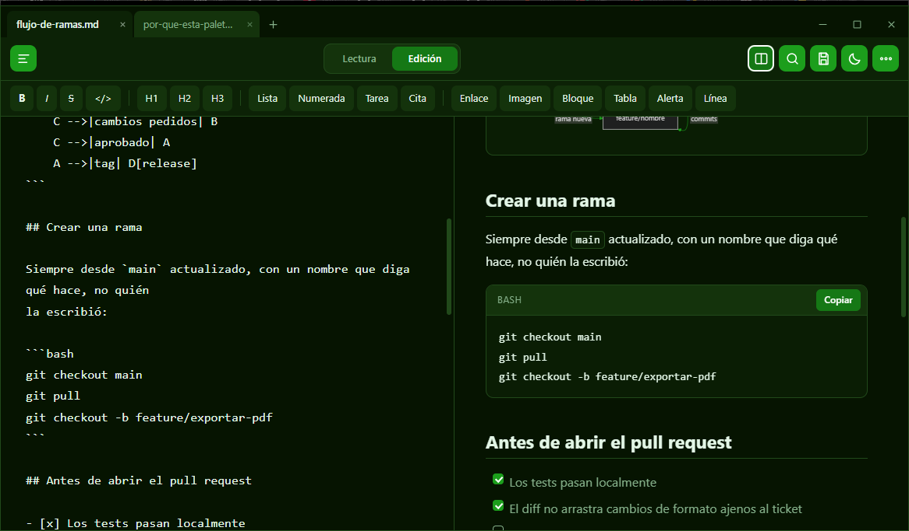
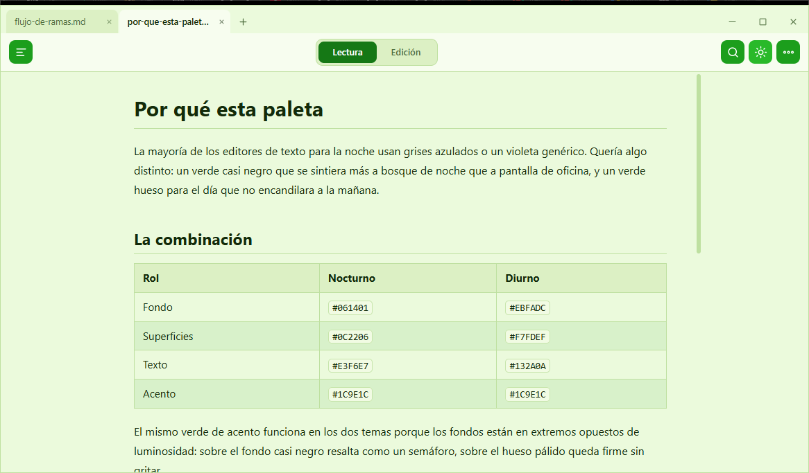
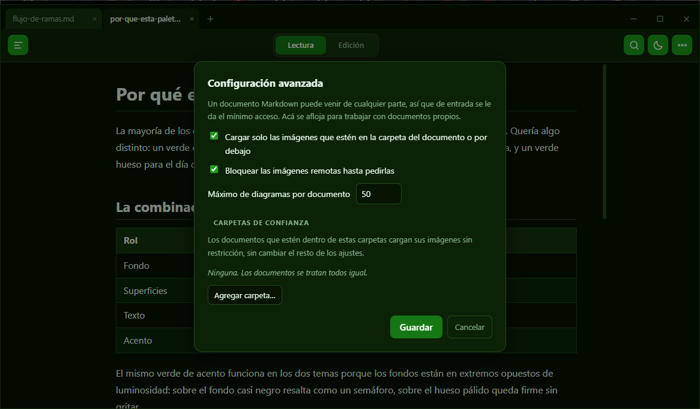

# Visor MD

[](https://github.com/PullAngel/visor-md/releases/latest)
[](LICENSE)
[](#instalación)

*[Read this in English](README.en.md)*

Visor y editor ligero de Markdown para Windows. Se fija como programa predeterminado
para los `.md`, abre al instante, funciona sin conexión, y trata el documento
que abre como contenido ajeno: abrirlo no genera ni una petición a internet.

### ▶ [Descargar VisorMD-portable.zip](https://github.com/PullAngel/visor-md/releases/latest/download/VisorMD-portable.zip)

Descomprimir y ejecutar. Sin instalador y sin dependencias. También en la
[página de releases](https://github.com/PullAngel/visor-md/releases), con el
hash del archivo y las versiones anteriores.



## Por qué lo hice

En Windows, un `.md` se abre en el Bloc de notas, que lo muestra como texto
plano, o dentro de un editor de código, que tarda en arrancar y es mucho más de
lo que hace falta para leer un archivo. Quería el equivalente a hacer doble clic
en un PDF: que se abra algo liviano y el documento ya se vea.

Después se sumó otra razón. Hoy muchos `.md` no los escribe uno: llegan de un
repositorio ajeno, de un conversor de PDF o de una herramienta de IA. Un
documento de origen desconocido puede **contener HTML, enlaces, recursos
externos y otro contenido que el visor tenga que interpretar**. Quería que
abrirlo fuera una operación segura por defecto: que el documento pudiera verse
tal como fue pensado, pero sin ganar acceso a nada que no le corresponda. Esa
terminó siendo la parte que más me ocupó.

## Qué hace

- **Lectura** con formato completo: tablas, listas de tareas, resaltado de
  sintaxis, alertas de GitHub, diagramas Mermaid y fórmulas LaTeX, con botón de
  copiar en cada bloque de código.
- **Edición** de texto plano con barra de ayudas y atajos, y vista dividida para
  ver el resultado en vivo mientras se escribe.
- **Pestañas y ventanas como en un navegador**: se arrastran para reordenarlas,
  se sueltan fuera para abrirlas aparte, o sobre otra ventana para moverlas ahí.
  Abrir ocho archivos a la vez los deja como ocho pestañas de una sola ventana.
- **Exporta a PDF** o a HTML, e imprime.
- Abre también archivos `.txt`, con la opción de convertirlos a `.md`.

<details>
<summary><b>Atajos de teclado</b></summary>

| Atajo | Acción |
| --- | --- |
| `Ctrl+T` / `Ctrl+W` | Pestaña nueva / cerrar pestaña |
| `Ctrl+Shift+N` | Ventana nueva |
| `Ctrl+Tab` / `Ctrl+Shift+Tab` | Pestaña siguiente / anterior |
| `Ctrl+R` / `Ctrl+E` | Modo lectura / edición |
| `Ctrl+\` | Vista dividida |
| `Ctrl+S` / `Ctrl+Shift+S` | Guardar / Guardar como |
| `Ctrl+O` | Abrir |
| `Ctrl+F` / `Ctrl+H` | Buscar / Reemplazar |
| `Ctrl+Shift+O` | Índice lateral |
| `Ctrl+D` | Tema nocturno o diurno |
| `Ctrl+P` | Imprimir o guardar en PDF |
| `F11` | Pantalla completa sin bordes |
| `Ctrl++` / `Ctrl+-` | Tamaño de texto |
| `Ctrl+B` `Ctrl+I` `Ctrl+K` | Negrita, cursiva, enlace |
| `Ctrl+1` a `Ctrl+3` | Títulos H1 a H3 |
| `Ctrl+Shift+` `X` `C` `T` `7` `8` `.` | Tachado, bloque de código, tarea, lista numerada, lista, cita |

En edición, `Enter` continúa la lista actual y la renumera, `Tab` y `Shift+Tab`
indentan la selección, y pegar una URL sobre texto seleccionado lo convierte en
enlace.
</details>

<details>
<summary><b>Formato admitido y funciones menores</b></summary>

Listas anidadas y numeradas, tablas con alineación, bloques de código dentro de
listas y citas, enlaces inline y de referencia, imágenes locales, HTML,
`<details>`, casillas de verificación, encabezados ATX y setext, escapes, vallas
de cuatro backticks y de `~~~`, notas al pie, autolinks, alertas de GitHub
(`> [!NOTE]`, `TIP`, `IMPORTANT`, `WARNING`, `CAUTION`), fórmulas LaTeX con
KaTeX, diagramas Mermaid y frontmatter YAML, que se oculta igual que en GitHub.

- Menú contextual distinto según dónde se haga clic derecho: pestaña, editor o
  documento renderizado.
- Buscar y reemplazar, en lectura y en edición.
- Índice lateral generado a partir de los encabezados.
- Al pasar de lectura a edición se conserva el punto donde se estaba leyendo.
- Las pestañas sin guardar toman su nombre del contenido.
- Archivos recientes, tipografía ajustable y detección de cambios hechos por
  otro programa mientras el documento está abierto.
</details>

## Seguridad

Un `.md` es contenido ajeno. Puede traer HTML, y ese HTML puede hacer cosas que
nadie espera de un documento de texto. La aplicación asume que el archivo es
hostil hasta demostrar lo contrario, y de ahí salen cuatro propiedades:

1. **Abrir un documento no genera ninguna petición a la red.** Ni por imagen,
   `srcset`, SVG, CSS, medios incrustados, diagrama o fórmula. Una imagen remota
   rastrea aunque no ejecute nada: confirma que abriste el archivo y entrega tu
   IP. Se cargan si las pedís, no antes.
2. **Nada del documento se ejecuta.** Todo el HTML pasa por DOMPurify con
   allowlist explícita de protocolos, y una CSP respalda la sanitización por
   debajo.
3. **Un documento no puede leer archivos que no le corresponden.** Las rutas se
   validan ya canonizadas, así que la comprobación cae sobre el archivo que se
   va a abrir y no sobre el nombre que lo pedía. Las rutas de red se rechazan
   siempre: resolver una `\\servidor\recurso` hace que Windows entregue
   credenciales sin mediar un clic.
4. **El documento no puede disfrazarse de la aplicación.** Queda contenido en su
   área, y lo que copiás de un bloque de código es lo que ves.

Las restricciones se pueden aflojar desde **Configuración avanzada**, con
carpetas de confianza para el trabajo propio. Lo que no es configurable es la
sanitización: se puede ampliar a qué recursos accede un documento, nunca qué
puede ejecutar.

Hay una suite dedicada, `tests/seguridad.py`, con su corpus de ataque en
`tests/security/`. En su primera ejecución encontró tres caminos de red que yo
había dado por cerrados —`srcset`, los SVG en línea y `background-image`— y los
tres son hoy pruebas de regresión.

El detalle completo está en
[`docs/frontera-de-seguridad.md`](docs/frontera-de-seguridad.md).

## Instalación

**Portable**: descomprimir
[`VisorMD-portable.zip`](https://github.com/PullAngel/visor-md/releases/latest/download/VisorMD-portable.zip)
y ejecutar `VisorMD.exe`. La carpeta se puede mover a un pendrive o a otra PC;
los ajustes se guardan aparte, en el perfil de Windows.

**En el equipo**: ejecutarlo una vez y elegir **Instalar en este equipo** en el
menú `···`. Copia la aplicación a `%LOCALAPPDATA%\Programs\VisorMD`, crea el
acceso directo en el menú Inicio y registra `.md`, `.markdown` y `.txt`. No pide
permisos de administrador, y se desinstala desde Configuración → Aplicaciones.

**Como programa predeterminado**: Windows no deja que una aplicación se fije a
sí misma, así que ese paso lo da siempre el usuario. Clic derecho en un `.md` →
**Abrir con** → **Elegir otra aplicación** → **Visor MD**, marcando *Usar
siempre esta aplicación*.

El ejecutable no tiene firma de código comprada, así que el primer arranque
puede mostrar la advertencia de SmartScreen: **Más información** → **Ejecutar de
todas formas**.

## Capturas

| | |
| --- | --- |
|  |  |
| Edición con vista dividida y el resultado en vivo | El mismo documento en tema día |



Las restricciones vienen puestas, pero se pueden editar desde Configuración avanzada.

Los documentos de las capturas están en [`examples/`](examples).

---

## Detalles técnicos

### Arquitectura

| Archivo | Contenido |
| --- | --- |
| `src/main.py` | Ventanas, pestañas, puente con JavaScript, archivos y ajustes |
| `src/winshell.py` | Instalación, registro de extensiones y desinstalación |
| `src/web/render.js` | Markdown a HTML, sanitización y post-proceso |
| `src/web/app.js` | Estado, pestañas, atajos y llamadas a Python |
| `src/web/editor.js` | Ayudas de escritura sobre el área de texto |
| `src/web/vendor/` | markdown-it, highlight.js, KaTeX, Mermaid y DOMPurify |

La interfaz corre sobre **WebView2**, el motor de Edge que Windows ya trae, de
modo que el ejecutable no empaqueta un navegador propio: son 14 MB en vez de los
150 de una aplicación Electron. Python se ocupa de los archivos, los diálogos
nativos y el registro de Windows; el render y la edición viven en JavaScript, y
entre los dos hay un puente de pywebview.

El editor es un `<textarea>` nativo y no un componente de terceros: conserva el
deshacer del sistema operativo y evita una dependencia. Mermaid pesa 3,5 de los
4,3 MB de librerías empaquetadas y se carga solo si el documento trae un
diagrama.

### Decisiones que valió la pena cuidar

**Archivos.** Se detectan UTF-8, UTF-8 con BOM, UTF-16 con BOM y cp1252, y se
conservan al guardar junto con el BOM y el tipo de fin de línea, CRLF o LF: un
archivo ajeno no debería cambiar de codificación por haberlo abierto. El
guardado es atómico —archivo temporal y reemplazo— para no dejarlo a medio
escribir ante un corte. Si el archivo cambia por fuera de la aplicación, al
recuperar el foco se ofrece recargarlo.

**Ventana.** La barra de título es propia, para que las pestañas compartan fila
con los botones de minimizar y cerrar. Quitar el marco nativo se lleva por
delante el redimensionado por bordes, Aero Snap y el maximizado correcto, y cada
pieza hay que reponerla a mano:
[`docs/ventana-sin-marco.md`](docs/ventana-sin-marco.md).

**Varias ventanas, un proceso.** Abrir una ventana nueva es instantáneo y mover
una pestaña entre ventanas no necesita comunicación entre procesos: el documento
viaja entero, con su codificación y sus cambios sin guardar.

### Pruebas

Tres suites, sin frameworks de por medio:

- `tests/test_files.py` — lectura y escritura en disco: codificaciones, BOM, fin
  de línea, guardado atómico y cambios externos.
- `tests/smoke.py` — abre la aplicación real, no un mock, y verifica el render
  contra un documento de casos límite, además de pestañas, menú contextual y el
  diálogo de cierre.
- `tests/seguridad.py` — el corpus hostil de `tests/security/`. Afirma
  propiedades concretas: que no queda ningún atributo `on*`, que no salió una
  petición a la red, que ninguna ruta escapó de la carpeta del documento.

```powershell
python tests\test_files.py
python tests\smoke.py
python tests\seguridad.py
```

No hay GitHub Actions, y es a propósito: dos de las tres suites manejan una
ventana real de WebView2, y una ventana que no se dibuja no tiene medidas. Un
runner sin escritorio no puede correrlas. Un CI que ejecutara solo la suite de
archivos pondría una insignia verde sobre un tercio de la cobertura, que
comunica peor que no tener ninguna.

### Desarrollo

```powershell
python -m pip install -r requirements.txt
python src\main.py tests\muestra.md
powershell -ExecutionPolicy Bypass -File build\build.ps1
```

El desarrollo fue asistido por IA, con las decisiones de arquitectura, seguridad
y producto revisadas y verificadas a mano. Varios de los cambios de las últimas
versiones salieron precisamente de esa verificación.

## Licencia

[GNU GPLv3](LICENSE) © 2026 [PullAngel](https://github.com/PullAngel)
