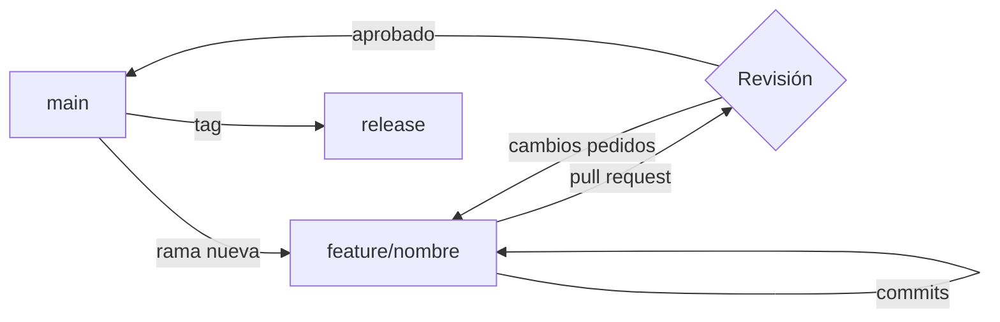

# Cómo organizamos las ramas en el equipo

Después de un par de releases con conflictos innecesarios, adoptamos un
flujo simple: `main` siempre queda desplegable, todo el trabajo nuevo vive
en una rama de feature de corta duración, y las ramas se borran apenas se
fusionan. Nada de ramas de integración ni de `develop` paralelo.

## El flujo, de un vistazo



## Crear una rama

Siempre desde `main` actualizado, con un nombre que diga qué hace, no quién
la escribió:

```bash
git checkout main
git pull
git checkout -b feature/exportar-pdf
```

## Antes de abrir el pull request

- [x] Los tests pasan localmente
- [x] El diff no arrastra cambios de formato ajenos al ticket
- [ ] La rama tiene menos de una semana de vida

> [!TIP]
> Una rama que dura más de una semana casi siempre significa que el ticket
> estaba mal cortado. Mejor partirlo en dos PRs chicos que revisar uno enorme.

## Comandos que usamos seguido

| Comando | Para qué |
| --- | --- |
| `git fetch --prune` | Limpiar referencias a ramas ya borradas en remoto |
| `git rebase main` | Traer los cambios de `main` sin un merge commit de más |
| `git commit --amend` | Corregir el último commit antes de subirlo |
| `git push --force-with-lease` | Actualizar la rama remota tras un rebase, sin pisar commits ajenos |

## Fusionar y limpiar

Una vez aprobado el PR, se fusiona con *squash* y la rama se borra en el
mismo paso, local y remota:

```bash
git checkout main
git pull
git branch -d feature/exportar-pdf
git push origin --delete feature/exportar-pdf
```

`main` queda con un commit por feature, fácil de leer en el historial y
fácil de revertir si algo sale mal.
