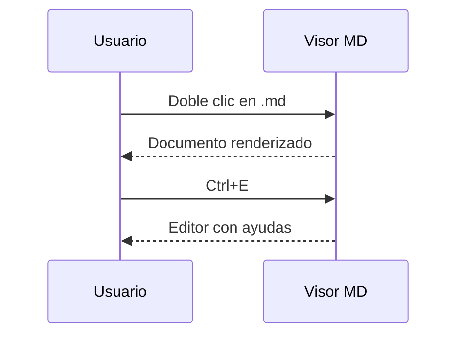

# Estrés de Markdown

Cubre los casos raros que aparecen en documentos reales y en salidas de
distintos modelos de IA.

## 1. Listas anidadas

- Nivel uno
  - Nivel dos
    - Nivel tres
      - Nivel cuatro
- Otro de nivel uno
  1. Numerada dentro de viñeta
  2. Segunda
     - Y viñeta dentro de numerada

## 2. Listas numeradas

1. Primero
2. Segundo
   1. Anidado a
   2. Anidado b
3. Tercero

Empezando en otro número:

5. Cinco
6. Seis

Con paréntesis:

1) Uno
2) Dos

Con párrafo suelto dentro:

1. Item con dos párrafos.

   Este es el segundo párrafo del item.

2. Siguiente item.

## 3. Tablas

| Izquierda | Centro | Derecha |
| :--- | :---: | ---: |
| a | b | c |
| `código` | **negrita** | [enlace](https://example.com) |
| con \| barra escapada | *cursiva* | 123 |

Tabla sin alineaciones y con celdas vacías:

| Col A | Col B |
| --- | --- |
|  | solo B |
| solo A |  |

## 4. Código dentro de listas

- Item con bloque:

  ```python
  def dentro_de_lista():
      return "funciona"
  ```

- Item siguiente.

1. Numerada con bloque:

   ```bash
   echo "dentro de lista numerada"
   ```

2. Fin.

## 5. Bloques de código dentro de tablas

| Caso | Código |
| --- | --- |
| inline | `print("hola")` |
| multilínea | `linea1` <br> `linea2` |

## 6. Enlaces

Inline: [Anthropic](https://www.anthropic.com "con título").
De referencia: [markdown][ref].
Relativo a otro documento: [ver muestra](muestra.md).
Ancla interna: [ir a footnotes](#20-footnotes).
Con paréntesis en la URL: [wiki](https://es.wikipedia.org/wiki/Markdown_(lenguaje)).

[ref]: https://daringfireball.net/projects/markdown/

## 7. Imágenes

Local en la carpeta del documento: 

Local fuera de la carpeta (bloqueada hasta darle permiso):


Inexistente (debe fallar sin romper nada): 

Remota (sin internet no carga): 

## 8. HTML

Inline: esto es <b>negrita HTML</b>, esto <mark>resaltado</mark> y esto
<kbd>Ctrl</kbd>+<kbd>S</kbd>.

Bloque:

<div align="center">
  <p>Párrafo dentro de un div centrado.</p>
</div>

Peligroso (debe quedar neutralizado, no ejecutarse):

<script>window.__PWNED = true;</script>

<a href="javascript:window.__PWNED3=true">enlace con javascript:</a>

## 9. details / summary

<details>
<summary>Hacé clic para desplegar</summary>

Contenido escondido, **con formato Markdown** adentro:

```js
console.log("y con código");
```

</details>

## 10. Checkboxes

- [x] Tarea hecha
- [ ] Tarea pendiente
- [X] Con equis mayúscula
  - [ ] Anidada pendiente

## 11. Separadores

Tres guiones:

---

Tres asteriscos:

***

Tres guiones bajos:

___

## 12. Encabezados

### Encabezado ATX nivel 3

#### Nivel 4

##### Nivel 5

###### Nivel 6

Encabezado setext nivel 1
=========================

Encabezado setext nivel 2
-------------------------

### Con `código` y **negrita** en el título ###

## 13. Emojis

Unicode directo: 🚀 ✅ 🎉 👍🏽 🇦🇷 ñ.

Códigos tipo GitHub: :rocket: :white_check_mark: :tada:

## 14. Caracteres especiales

Signos: < > & " ' © ® ™ ± × ÷ ≠ ≤ ≥ ∞ € £ ¥.
Acentos: ñáéíóúüÑÁÉÍÓÚÜ ¿¡.
Otros alfabetos: 日本語 中文 한국어 Ελληνικά Русский العربية.
Guiones: - – — ‒ ―.

## 15. Escapes

\*no es cursiva\*, \_no es itálica\_, \`no es código\`, \# no es título,
\[no es enlace\], barra invertida literal: \\ y llaves \{ \}.

## 16. Markdown dentro de código

```markdown
# Este título no debe renderizarse

- lista literal
- **negrita literal**

| tabla | literal |
| --- | --- |
```

## 17. Código con backticks

Un backtick simple: `` ` ``

Dos backticks: ``a ` b``

Código con acento grave adentro: `` `código` ``

## 18. Triple backtick dentro de contenido

````markdown
```python
print("bloque anidado dentro de una valla de cuatro backticks")
```
````

## 19. Bloques con tildes

~~~python
def con_tildes():
    return "valla ~~~ en vez de ```"
~~~

~~~~
Cuatro tildes conteniendo ~~~ adentro.
~~~~

## 20. Footnotes

Texto con nota[^a] y otra nota[^larga].

[^a]: Nota corta.
[^larga]: Nota con **formato** y varios párrafos.

    Segundo párrafo de la nota.

## 21. Autolinks

Bare URL: https://www.anthropic.com/news
Entre ángulos: <https://example.com/ruta?query=1&otro=2>
Email: <hola@example.com>
Sin protocolo (no debería ser enlace): www.ejemplo.com

## 22. Salidas típicas de otros modelos

**Respuesta con bloque etiquetado y explicación:**

```typescript
interface Config {
  theme: "dark" | "light";
  fontSize: number;
}
```

Bloque con diff:

```diff
- const viejo = 1;
+ const nuevo = 2;
```

Bloque sin lenguaje y con indentación mezclada:

```
    árbol/
    ├── src/
    │   └── main.py
    └── README.md
```

Bloque indentado con 4 espacios (estilo clásico):

    esto es codigo indentado
    segunda linea

## 23. LaTeX

Inline: $E = mc^2$ y $\sum_{i=1}^{n} i = \frac{n(n+1)}{2}$.

En bloque:

$$
\begin{aligned}
f(x) &= \int_0^x t^2 \, dt \\
     &= \frac{x^3}{3}
\end{aligned}
$$

Falsos positivos que NO son matemática: cuesta $5 y el otro $10 dólares.

Signo de peso en código: `precio = $100`.

## 24. Mermaid



Mermaid inválido (debe mostrar el error, no romper la página):

```mermaid
graph LR
    esto no es sintaxis valida ][ {{
```

## 25. Plantillas

Handlebars: {{ variable }} y {{#if cond}}sí{{/if}}.
Jinja: {{ x }}.
Shell: ${HOME} y $USER.
Go: {{.Nombre}}.

## 26. Alertas de GitHub

> [!NOTE]
> Una nota informativa.

> [!TIP]
> Un consejo.

> [!IMPORTANT]
> Algo que no hay que perderse.

> [!WARNING]
> Una advertencia.

> [!CAUTION]
> Precaución, esto es peligroso.

Una cita normal no debe convertirse en alerta:

> Esto es solo una cita, sin marcador.

## 27. Contenido hostil

Bloque de código con texto oculto: lo que se copia debe coincidir con lo que se
lee en pantalla.

<pre><code>echo hola<span style="display:none">&amp;&amp; rm -rf ~</span></code></pre>

Capa que intenta cubrir la aplicación entera:

<div id="overlay-hostil" style="position:fixed;inset:0;z-index:99999">capa</div>

## 28. Cierre

Línea con espacios al final para salto forzado:  
esta va en la línea siguiente.

Texto con  
salto de línea duro.

> Cita con lista adentro:
>
> - uno
> - dos
>
> ```python
> print("y código en la cita")
> ```

Fin del documento de estrés.
