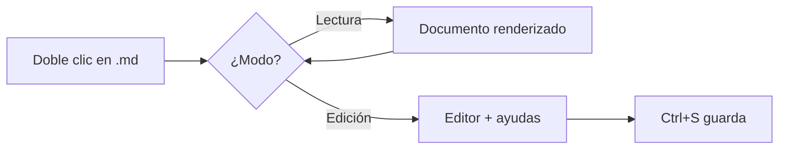

# Documento de prueba de Visor MD

Este archivo existe para revisar de un vistazo que **todo el formato** se
renderice bien: encabezados, tablas, código, tareas, diagramas y fórmulas.
Incluye acentos, eñes y símbolos: ñáéíóú ¿¡ « » — €.

## Texto e inline

Texto normal con **negrita**, *cursiva*, ***ambas***, ~~tachado~~,
`código en línea`, un [enlace externo](https://daringfireball.net/projects/markdown/)
y una tecla <kbd>Ctrl</kbd> (el HTML se renderiza, pero pasa por DOMPurify).

> Una cita en bloque para ver el borde de acento.
>
> Con un segundo párrafo adentro.

---

## Listas

- Primer elemento
- Segundo elemento
  - Anidado uno
  - Anidado dos
- Tercer elemento

1. Paso uno
2. Paso dos
3. Paso tres

### Lista de tareas

- [x] Renderizar Markdown
- [x] Botón de copiar en los bloques de código
- [ ] Firmar el ejecutable
- [ ] Dominar el mundo

## Tabla

| Función | Atajo | Modo |
| --- | --- | --- |
| Guardar | `Ctrl+S` | Edición |
| Buscar | `Ctrl+F` | Ambos |
| Vista dividida | `Ctrl+\` | Edición |
| Cambiar tema | `Ctrl+D` | Ambos |

## Bloques de código

```python
def saludar(nombre: str) -> str:
    """Devuelve un saludo."""
    return f"Hola, {nombre}"

print(saludar("mundo"))
```

```javascript
const doble = (xs) => xs.map((x) => x * 2);
console.log(doble([1, 2, 3]));  // [2, 4, 6]
```

```json
{ "tema": "oscuro", "fuente": 16, "recientes": [] }
```

```bash
python src/main.py tests/muestra.md
```

```
Bloque sin lenguaje: no se resalta, pero igual se puede copiar.
```

## Matemáticas

Inline: la identidad de Euler es $e^{i\pi} + 1 = 0$.

Y en bloque:

$$
\int_{-\infty}^{\infty} e^{-x^2}\,dx = \sqrt{\pi}
$$

## Diagrama Mermaid



## Lista de definiciones

Markdown
: Lenguaje de marcado ligero para escribir texto con formato.

WebView2
: El motor de Edge que Windows ya trae instalado y que esta app reutiliza.

## Notas al pie

Esta app pesa poco porque no empaqueta su propio navegador[^1].

[^1]: Usa el WebView2 del sistema, igual que muchas apps nativas de Windows.

## Texto largo

Lorem ipsum dolor sit amet, consectetur adipiscing elit. Sed do eiusmod tempor
incididunt ut labore et dolore magna aliqua. Ut enim ad minim veniam, quis
nostrud exercitation ullamco laboris nisi ut aliquip ex ea commodo consequat.
Duis aute irure dolor in reprehenderit in voluptate velit esse cillum dolore eu
fugiat nulla pariatur. Excepteur sint occaecat cupidatat non proident, sunt in
culpa qui officia deserunt mollit anim id est laborum.

### Fin

Si todo lo anterior se ve correctamente, el visor funciona.
