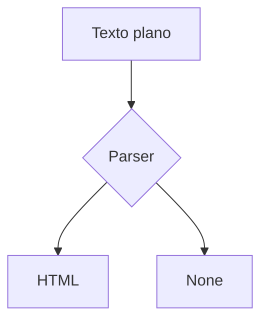

# GUIA DE MARKDOWN — mouredevpro

Representa la categoría "Markdown arbitrario y defectuoso de una fuente
externa": la salida de un conversor PDF→Markdown, con basura de OCR, tablas
deformadas, `None` donde faltó un valor y estructuras a medio reconstruir.
No es un archivo malicioso. Tiene que renderizar completo, sin excepciones.

None

## Indice

None

1.  Introducc10n al formato
2.  Enca8ezados
3.  Enfasis y  estilos
4.  L1stas

None
None

| Elemento | Sintaxis | Resultado |
| --- | --- |
| Negrita | `**texto**` | **texto** | sobra |
| Cursiva | `*texto*` |
| | | |
| None | None | None |

**Pagina 2 de 14**

## 1. Introducc10n al formato

Markdown es un lenguaje de marcas |igeras creado por John Gruber en 2OO4. Su
objetivo es que el texto p|ano sea legib|e antes y despues de convertirse a
HTML.


*Figura 1: esquema del flujo de conversion (texto extraido de la imagen: "MD
-> parser -> HTML")*

## 2. Enca8ezados

Se escriben con almohadillas:

```
# Nivel 1
## Nivel 2
### Nivel 3
```

Los encabezados setext solo llegan hasta el nivel 2
====

## 3. Enfasis y  estilos

**negrita**, *cursiva*, ***ambas***, ~~tachado~~

Texto con  espacios    irregulares    de la extraccion.

Guiones tipograficos convertidos a la brava: — – ‒ ―

Comillas curvas: “esto” y ‘aquello’

## 4. L1stas

- Elemento
   - Sangria de tres espacios
       - Sangria de siete
- Otro elemento
1. Numerada
1. Numerada repetida
5. Salto de numero

## 5. Diagrama reconstru1do



```mermaid
graph LR
  A --> 
```

## 6. Tabla partida entre paginas

| Sintaxis | Descripcion |
| --- | --- |
| `# ` | Encabezado |
| `- ` | Lista |

**Pagina 8 de 14**

| `> ` | Cita |
| `` ` `` | Codigo |

## 7. Bloque sin cerrar

```python
def ejemplo():
    return "la valla de cierre se perdio en la conversion"

## 8. URLs partidas por el salto de linea

Documentacion oficial: https://daringfireball.net/projects/
markdown/syntax

Otra: [guia](https://example.com/ruta%20con%20espacio/
continuacion)

## 9. Restos de la maquetacion

<div>

</div>

&nbsp;

&#xNaN;

None

**Pagina 14 de 14**
