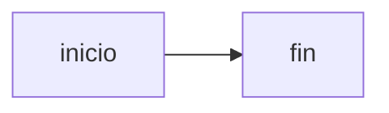

# Peticiones de red al abrir

Abrir este documento no debe generar ni una sola petición a un servidor
remoto. Cada bloque prueba una vía distinta de pedir un recurso externo.

## Imagen Markdown

## Imagen HTML con atributos de respaldo

<picture>
  <source srcset="https://rastreo.example/d.webp" type="image/webp">
  
</picture>

## Recursos incrustados

<video src="https://rastreo.example/v.mp4" autoplay></video>
<audio src="https://rastreo.example/a.mp3" autoplay></audio>
<track src="https://rastreo.example/s.vtt">
<link rel="stylesheet" href="https://rastreo.example/hoja.css">
<link rel="preload" as="image" href="https://rastreo.example/p.png">
<link rel="prefetch" href="https://rastreo.example/q.html">

## Estilo con recurso externo

fondo

## SVG con recurso externo

<svg xmlns="http://www.w3.org/2000/svg" width="20" height="20">
  <image href="https://rastreo.example/dentro.png" width="20" height="20"/>
  <use href="https://rastreo.example/simbolo.svg#x"/>
</svg>

## Diagrama con recurso externo

## Fórmula con recurso externo

$\includegraphics{https://rastreo.example/formula.png}$

$\href{https://rastreo.example/enlace}{texto}$

## Imagen local, que sí debe cargarse

