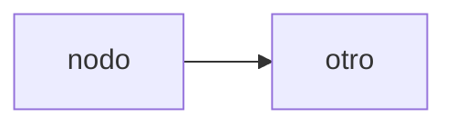
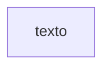
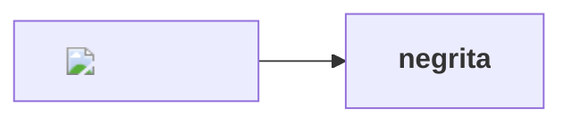
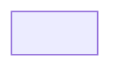
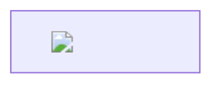
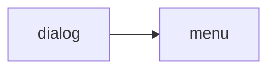
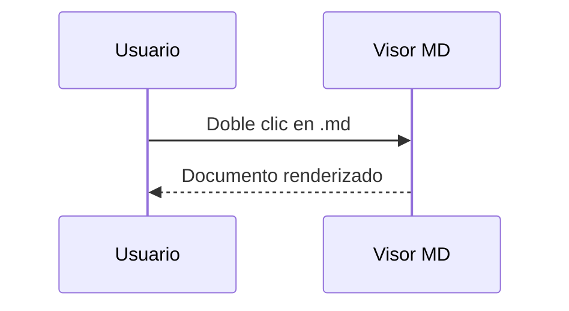
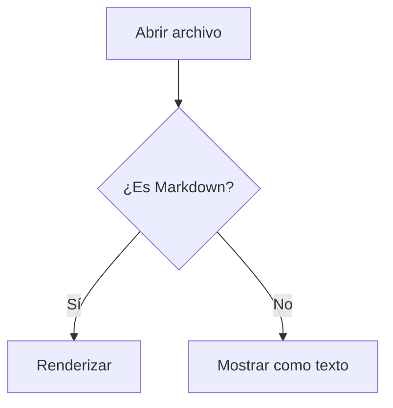

# Diagramas hostiles

Mermaid recibe código que controla el documento y devuelve SVG que se inserta
en la página. Estos diagramas intentan que ese SVG traiga algo activo.

## Acciones de clic y llamadas



## Enlace con protocolo peligroso



## Etiquetas con HTML





## Recurso remoto dentro del diagrama



## Estilo inyectado en el diagrama

```mermaid
graph LR
  A[nodo]
  style A fill:url("https://rastreo.example/relleno.png")
```

## Identificador que choca con la interfaz



## Diagrama válido: debe seguir dibujándose igual




